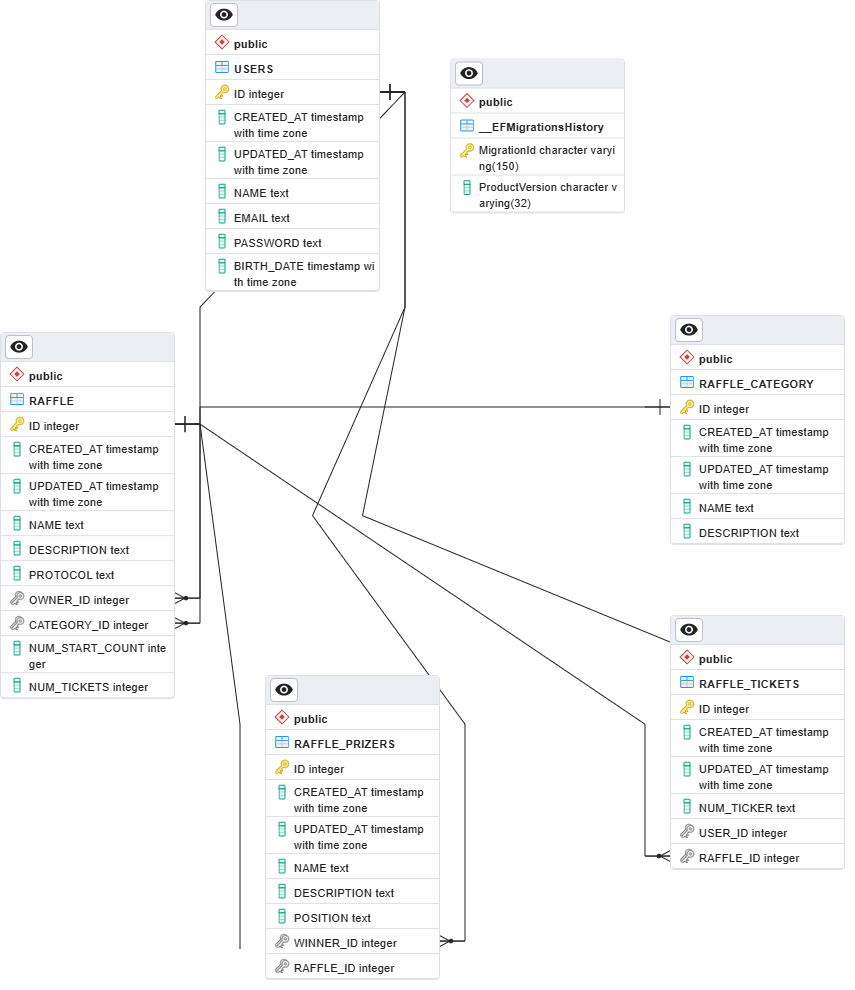

# rifaz
app de rifas
aplicação feita em .Net Core 6

# ANOTATIONS

## MIGRATIONS

    cd App.Rifas.Core.DataAccess
    
### CREATE MIGRATIONS

    dotnet ef --startup-project ../App.Rifas.Core.Api/App.Rifas.Core.Api migrations add myMigration01

### UPDATE MIGRATIONS
	
	dotnet ef --startup-project ../App.Rifas.Core.Api/App.Rifas.Core.Api database update
	

### REMOVE MIGRATIONS

	dotnet ef --startup-project ../App.Rifas.Core.Api/App.Rifas.Core.Api migrations remove
